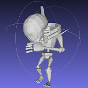

# Pose2Carton 

EE228 课程大作业，利用3D骨架控制3D卡通人物。

# Maya 环境配置

Windows下Maya环境配置：

1、下载安装maya。先申请一个autodesk账户，同时申请教育版权限，之后会获得maya2020安装包的链接，安装maya2020

2、根据路径C:\Users\用户名\Documents\maya\2020，找到zh_CN文件夹，并将其中内容放到该文件所在的目录。

3、安装pip和numpy。进入maya2020安装目录，进入bin文件夹，将该路径添加到环境变量。接着打开cmd输入mayapy并安装pip和numpy

4、检查环境。在mayapy中检测一系列的import命令能否顺利运行，如果可以，那么环境配置已经完成。

# 匹配流程

任务1：十个所给模型的匹配与可视化：

①从助教提供的71组模型中挑出满足以下条件的十个模型：

·模型不一定是人，但必须呈人形

·fbx呈T-pose

·对应的txt文件中有关节spine或其他等效关节(否则模型无法完成弯腰动作)

②在transfer.py中，将manual_model_to_smpl置为空字典，再将待匹配模型txt文件的相对路径和info_seq_5.pkl的相对路径作为函数transfer_one_sequence的输入参数，运行程序。程序会报错并输出两个字典。第一个字典保存的是模型的各关节名和它们的索引序号，第二个字典保存的是各关节的运动学关系。

③根据②中的两个字典手动填写字典manual_model_to_smpl。字典的key值是该模型与模板的24个关节中相同的关节的索引，value值是相应的关节在列表smpl_joint_names中的序号。

④再次运行transfer.py。会在results文件夹中生成一个pkl文件，保存的是模型匹配后姿态信息。另外还会在obj_seq_5_3dmodel文件夹中生成448个obj和txt，保存的是模型与info_seq_5.pkl匹配后所有动作的有关信息。

⑤可视化。将obj_seq_5文件夹与vis.py放在同一个目录下，再运行vis.py。运行完毕后会在vis文件夹生成447个png文件和一个mp4文件。每个png文件保存的模型匹配后的每一帧动作，mp4保存的是将每帧动作连贯起来后得到的一个18s动画。

任务2：五个网上下载模型的匹配加蒙皮可视化：

①在网上挑选满足以下条件的5个模型并下载相应的fbx：

·模型不一定是人，但必须呈人形

·fbx呈T-pose

·能够顺利运行fbx_parser.py并生成fbm文件夹

·fbm文件夹至少含有一张包含蒙皮所有信息的图片

·parser出来的txt能够顺利运行transfer.py

②在mayapy环境中运行fbx_parser.py对上述fbx进行解析，得到前文所述的fbm文件夹、obj、txt、intermediate.mtl、intermediate.obj。

③在transfer.py中，将manual_model_to_smpl置为空字典。将待匹配模型txt文件的相对路径作为函数transfer_one_frame的输入参数，再将其与info_seq_5.pkl的相对路径作为函数transfer_one_sequence的输入参数，并将两个函数的参数use_online_model都置为true，运行程序。运行完毕后会输出两个字典。第一个字典保存的是模型的各关节名和它们的索引序号，第二个字典保存的是各关节的运动学关系。

④根据②中的两个字典手动填写字典manual_model_to_smpl。字典的key值是该模型与模板的24个关节中相同的关节的索引，value值是相应的关节在列表smpl_joint_names中的序号。

⑤再次运行transfer.py。其中函数transfer_one_sequence在调用完后会在results文件夹中生成一个pkl文件，保存的是模型匹配后姿态信息。另外还会在obj_seq_5_3dmodel文件夹中生成448个obj和txt，保存的是模型与info_seq_5.pkl匹配后所有动作的有关信息。最后还会生成一个之前parser出的intermediate.mtl的快捷方式。函数transfer_one_sequence在调用完后会在txt所在的目录下生成一个116_out.obj和116_out.txt，保存的分别是模型与pose_samples文件夹中116.obj进行匹配后的动作和关节信息。

⑥修改intermediate.mtl文件。用记事本将其打开，在Tf开头所在行下面添加一行，写上”map_Kd fbm文件夹中的图片名”，如” map_Kd rp_nathan_animated_003_dif.jpg”。最后将该图片复制到obj_seq_5_3dmodel文件夹中。

⑦可视化。将vis.py第14行use_online_model置为True，再运行vis.py。运行完毕后会在vis文件夹生成447个png文件和一个mp4文件。每个png文件保存的是模型匹配并蒙皮后的每一帧动作，mp4保存的是将每帧动作连贯起来后得到的一个18s动画。

# 新增脚本说明

无

# 项目结果

group 33, 34是一个小组，这里共上传了两个group共三十张匹配结果。其中第1张图为模板动作截图，后30张图为模型匹配结果截图。其中，前20张为助教提供模型，后10张为网上下载模型。

# 协议 
本项目在 Apache-2.0 协议下开源

所涉及代码及数据的最终解释权归倪冰冰老师课题组所有

Group 33, 34
